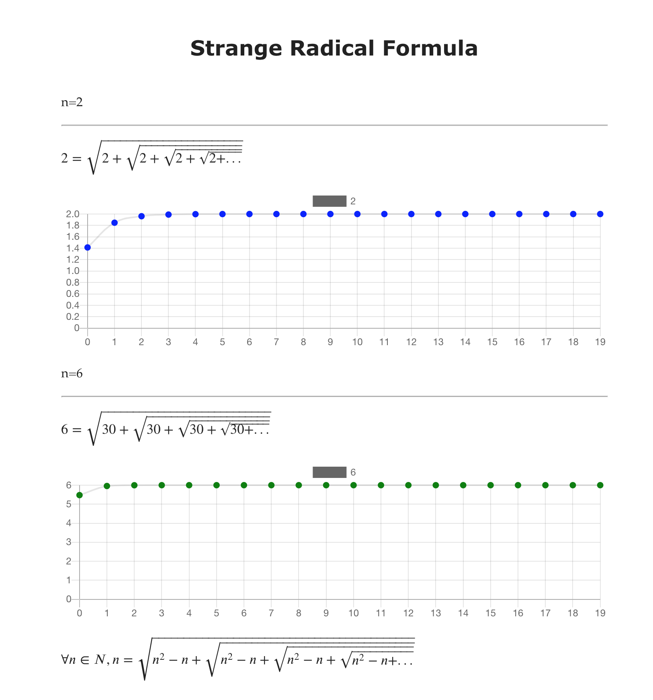

bs-chart [](https://travis-ci.com/mamewotoko/bs-chart)
==================

A BuckeScript bindings of [Chart.js](https://www.chartjs.org/)



Plot with chart.js is embedded in markdeep document.

Examples
--------
* basic [demo](https://mamewotoko.github.io/bs-chart/examples/), [HTML source](examples/index.html), [bs](./examples/src/main.ml)
* markdeep, lines [demo](https://mamewotoko.github.io/bs-chart/examples/radical.md.html),  [bs](./examples/src/radical_main.ml)

Setup
------

```
setup-opam
npm install
```

Build sample
--------------

```
sh buils.sh
```

Open
-----

1. start web server

    ```
    npm run serve
    ```

2. browse [docs/index.html](http://localhost:8060/examples/) or [doc/radical.md.html](http://localhost:8080/examples/radical.md.html)

Clean
-----

```
sh clean.sh
```

Files
-------

```
examples/src/main.ml: example app1
             js/main.js: target code
         index.html
             radical_main.ml: example app2
             js/radical.main.js: target code
         radical.md.html

src/chartjs.ml: bindins (library code)
```

TODO
----------

* support more features of chart.js
* support timeseries
* visualize events
* covert chart.js 2 code to chart.js 3 code?

References
----------

* [Chart.js Open source HTML5 Charts for your website](https://www.chartjs.org/)
* Strange radical formula [Tweet](https://twitter.com/pickover/status/1272696555338940426)

----
Takashi Masuyama < mamewotoko@gmail.com >

https://mamewo.ddo.jp/
